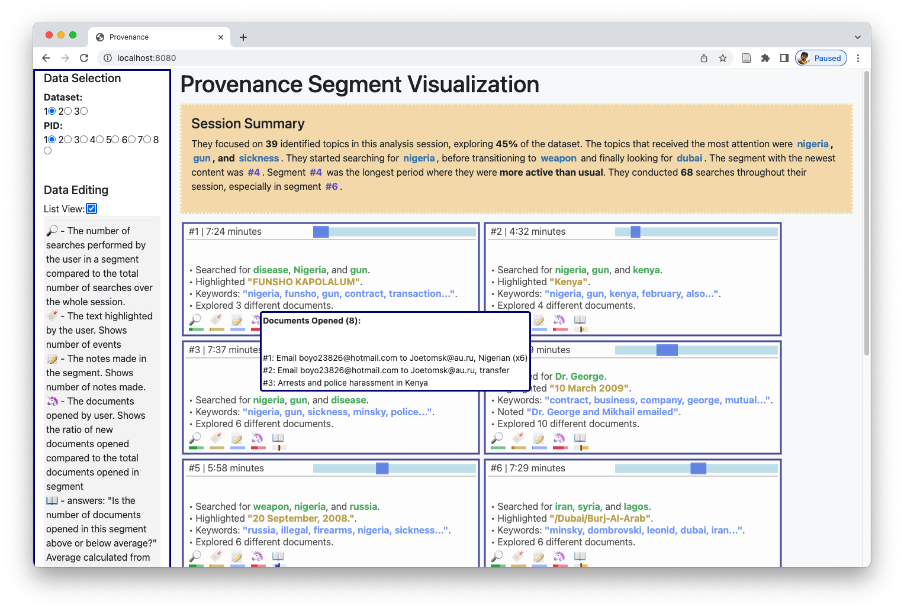

# Spygest Project

This is a repository for the development of a provenance summarization pipeline for the Spring 2023 session of CAP 6940 - Natural Language Processing at the University of Florida.

The team will use this repository to share code, the dataset, and more.
