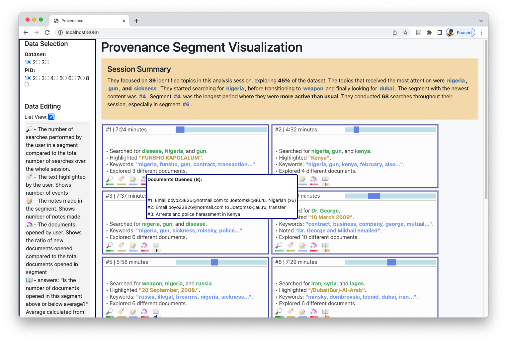

# Spygest Project



This is a repository for the development of a provenance summarization pipeline for the Spring 2023 session of CAP 6940 - Natural Language Processing at the University of Florida.

The team will use this repository to share code, the dataset, and more.

## Project Goal

We are building and testing the possibility of generating natural language summaries from interaction histories.
Weather this is generated from a corpus of sentences for every event and summarized or other intermediary steps, we want to understand:

1. feasibility of generating sentences from interaction histories
2. Comparison of features between human generated summaries of interaction histories and the automated approach
3. Evaluate human preferences

### Running the Original Web app

Everything you need to run the web app should already be generated.
If you make changes to the data or try new interpretations of the data you may need to run the generateManifest.py python script.
Those instructions are [here](#generating-an-application-manifestjson).

This interface uses the [d3](https://d3js.org) visualization library to display the data in cards as SVG elements.
For this reason, a web server needs to be running to generate the interface instead of just opening the `index.html` file.

#### Steps

1. From the project directory, launch a web server. (e.g. `>$ http-server` in bash terminal)
2. Open web browser, and navigate to `localhost:8080` (this is the default location for most local development servers).
3. navigate to the index.html file (`/original_web_interface/index.html`)

### Generating an Application Manifest.json

The application manifest included many of the components needed to run the application.
The manifest includes interactions from each user in the dataset, the segmentation of those interactions and the "superlatives" used to generate the overarching summary at the top of the page.

The `ApplicationManifest.json` is ingested and processed by the same script that runs the rest of the web application: `manifestInterpreter.js`.
`manifestInterpreter.js` also pulls in docuemnt information to run, so it will requre access to the `/data/` folder with the various datasets to run.

Use the `generateManifest.py` script to interpret the datasets (after  `data_prep_scripts` are run) to calculate and centralize all the data into a single `ApplicationManifest.json`

Move terminal to the project directory.
Using python 3.8 (or probably any version of python3), run the following to generate a new Application Manifest:

```sh
cd [Current Project Directory]
python3 ./original_web_interface/generateManifest.py -1
```
